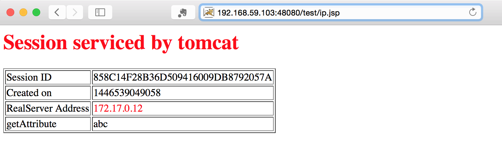



本文主要描述如何从基础镜像开始，逐步实现ssh安装、Jdk及Tomcat的安装，最终实现从镜像运行容器时，可以
直接访问该容器内的Tomcat项目页面，为将该容器作为mesos-slave作准备。

 

---

##### 下载基础镜像


docker pull ubuntu:14.04


##### 创建容器


docker pull ubuntu:14.04


##### 启动容器


docker start containerid


##### 进入容器


docker exec -it containerid /bin/bash


##### 设置root密码


passwd root 


##### 添加用户并赋予管理员权限


adduser xialingsc  
password for xx:
输入xialingsc用户的密码，出现如下信息
正在添加用户”xialingsc"…
正在添加新组”xialingsc" (1000)…
正在添加新用户”xialingsc" (1000) 到组”xialingsc"…
创建主目录"/home/xialingsc"…
正在从"/etc/skel"复制文件…
输入新的 UNIX 口令：
重新输入新的 UNIX 口令：
两次输入xialingsc的初始密码，出现的信息如下
passwd: password updated successfully
Changing the user information for xialingsc
Enter the new value, or press ENTER for the default
Full Name []:
Room Number []:
Work Phone []:
Home Phone []:
Other []:
Full Name []:等信息一路回车
这个信息是否正确？ [Y/n] y
到此，用户添加成功。如果需要让此用户有root权限，执行命令：
root@ubuntu:~# vi /etc/sudoers
修改文件如下：
# User privilege specification
root    ALL=(ALL:ALL) ALL
xialingsc     ALL=(ALL:ALL) ALL
保存退出，xialingsc用户就拥有了root权限。


##### 更换vi


尽管默认vi中，vi 方向键乱码，delete键不能删除，但仍可通过如下方式解决
sed -i 's/set compatible/set nocompatible/g' /etc/vim/vimrc.tiny
set backspace=2
但想要设置高亮等特性，例如syn on 或者syntax on则出现语法错误


##### 安装ssh服务


apt-get install openssh-server
如果下载失败，可能是由于系统需要更新的缘故，尝试更新一下
apt-get update
配置ssh_config
vi etc/ssh/ssh_config
打开22端口注释(默认采用的是密码登录，这里还有别的配置，可根据实际情况进行修改。比如采用密钥文件登录，更改22服务端口便于安全)，即打开Port 22
打开 PasswordAuthentication yes
保存并退出。

配置sshd_config
vi /etc/ssh/sshd_config
PermitRootLogin without-password
改为
PermitRootLogin yes

重启ssh服务
/etc/init.d/ssh restart
检查ssh是否启动
ps -ef |grep ssh
进程ssh-agent是客户端，sshd为服务器端，如果结果中有sshd的进程说明openssh-server已经启动，如果没有则需运行命令启动

启动、停止和重启openssh-server的命令如下
/etc/init.d/ssh start
/etc/init.d/ssh stop
/etc/init.d/ssh restart

在docker run时启动ssh服务两种方法(两种方法都试过，好用)：
方法一：
Ubuntu中配置openssh-server开机自动启动
打开/etc/rc.local文件，在exit 0语句前加入：
/etc/init.d/ssh start

运行docker容器方式为：
docker run -i -t -d -p 50022:22 --name ubuntu-base ubuntu-gap:14.04 

方法二：直接在docker run时指定
docker run -i -t -d -p 50022:22 --name ubuntu-base ubuntu-gap:14.04 /usr/sbin/sshd -D




若遇到“Host key verification failed”，可删掉“Offending RSA key in /Users/watsy/.ssh/known_hosts:n ”指定的第n行;

接下来还可以更换zsh、修改字符集、Docker 容器时间不同步问题

##### 安装JDK


拷贝 jdk-6u45-linux-x64.bin
跨主机多种拷贝方式：scp -P port -r 源文件目录 目标文件目录
scp 源文件  目录文件目录
例如：scp -r xialing@192.168.1.154:/Users/xialing/Software/Tomcat/apache-tomcat-5.5.20 ./
scp -P 50022 -r xialing@192.168.59.103:/Users/xialing/Software/Tomcat/apache-tomcat-5.5.20 ./  
scp xialing@192.168.1.154:/Users/xialing/Software/Jdk/jdk-6u45-linux-x64.bin ./
执行./jdk-6u45-linux-x64.bin
cd jdk1.6.0_45 检查
配置JAVA_HOME
vi .zshrc
#增加
export JAVA_HOME=/home/gap/software/jdk6/jdk1.6.0_45
export PATH=$JAVA_HOME/bin:$PATH
source .zshrc
#验证
java -version


##### 安装Tomcat


拷贝 scp -r xl@192.168.1.171:/home/xl/software/tomcat5.5/apache-tomcat-5.5.20 ./
增加TOMCAT启动内存及确定字符集
vi software/apache-tomcat-5.5.20/bin/catalina.sh
#在catalina.sh中Execute The Requested Command 下方增加，例如
# ----- Execute The Requested Command -----------------------------------------
JAVA_OPTS="-Xms2048m -Xmx6144m -XX:PermSize=256M -XX:MaxNewSize=256M -XX:MaxPermSize=256M -Dfile.encoding=UTF-8"
配置TOMCAT_HOME
vi .zshrc
#增加
export TOMCAT_HOME=/home/gap/software/apache-tomcat-5.5.20
export PATH=$TOMCAT_HOME/bin:$PATH
source .zshrc



我们的目标是：在docker run 时，tomcat也能随着启动，所以我们需要在Tomcat的启动时设置JAVA_HOME或JRE，否则会出现找不到JAVA_HOME或JRE的情况(尽管之前在环境变量中设置过JAVA_HOME,但不好使)。

接下来在$TOMCAT_HOME/bin/setclasspath.sh中# First clear out the user classpath 上方加入export JAVA_HOME=\root\software\jdk1.6.0_45

这里还可以加入自己的相关项目文件，用于验证。

##### 提交容器为镜像


docker commit -a xialingsc -m "create a base image for paper" containeid paper-image


##### 运行新容器


docker run -i -t -d -p 40022:22 -p 48080:8080   --name paper-slave paper-image:latest \ 
/bin/sh -c "/root/software/apache-tomcat-5.5.20/bin/startup.sh && /usr/sbin/sshd -D"


##### 验证访问

这是我们可以在浏览器中敲入http://192.168.59.103:48080/test/ip.jsp进行访问了

