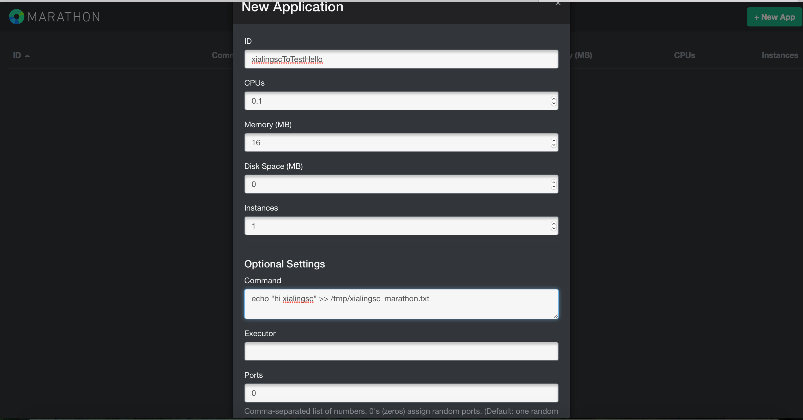
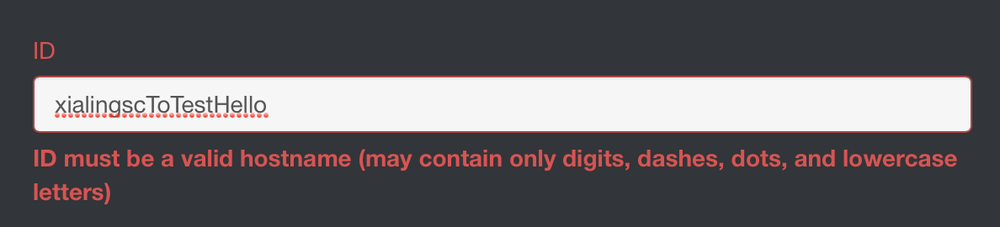



本文记录了在MacOs上利用Docker通过七个简单步骤实现单节点Mesos集群的部署

 

---

## 简单介绍

这个测试需要启动四个容器，分别是ZooKeeper,Mesos Master,Marathon,Mesos Slave,Zookeeper提供服务发现功能，即保证Slave能够被Master发现和管理；Marathon是Mesos生态圈打造的一个轻量级、扩展性很强的长运行服务的调度框架。支持RESTful api来创建和管理app，自动为app做容错迁移，凡是能用shell起的任务，理论上都可以通过Marathon在mesos上简单地启动和管理起来。很多技术人员根据其汉语含义称其为"马拉松"。基于Mesos+marathon的架构在很多生产场景都经受住了考验，并得到业界的广泛认可。

## 部署步骤

整个过程需要保证测试的机器上已安装了Docker的运行环境。

### 第一步：设置承载四个Docker容器运行的IP地址

如果在Mac本机运行，通过在命令行中设置HOST_IP=192.168.59.103为其IP地址。若为Linux系统则通过ifconfig查看IP地址，并设置其为预承载四个Docker容器运行的服务器地址。

### 第二步：启动ZooKeeper容器



docker run -d -p 2181:2181 -p 2888:2888 -p 3888:3888 garland/zookeeper
这里的含义是指在后台运行一个由garland/zookeeper镜像产生的打开2181,2888,3888端口的容器。



### 第三步：启动Mesos Master



docker run --net="host" -p 5050:5050 -e "MESOS_HOSTNAME=${HOST_IP}" -e "MESOS_IP=${HOST_IP}" \ 
-e "MESOS_ZK=zk://${HOST_IP}:2181/mesos" -e "MESOS_PORT=5050" -e "MESOS_LOG_DIR=/var/log/mesos" \ 
-e "MESOS_QUORUM=1" -e "MESOS_REGISTRY=in_memory" -e "MESOS_WORK_DIR=/var/lib/mesos" \ 
-d garland/mesosphere-docker-mesos-master
这里的含义是在后台运行一个由garland/mesosphere-docker-mesos-master镜像产生的网络模式为host方式的
打开5050端口的容器，同时设置了8个环境变量



### 第四步：启动Marathon



docker run -d -p 8080:8080 garland/mesosphere-docker-marathon --master zk://${HOST_IP}:2181/mesos \
--zk zk://${HOST_IP}:2181/marathon
这里的含义是在后台运行一个由garland/mesosphere-docker-marathon镜像产生的打开端口8080端口的容器，这里
连接的是在HOST_IP上运行的mesos master和zk。



### 第五步：启动Mesos slave



docker run -d --name mesos_slave_1 --entrypoint="mesos-slave" 
-e "MESOS_MASTER=zk://${HOST_IP}:2181/mesos" -e "MESOS_LOG_DIR=/var/log/mesos" 
-e "MESOS_LOGGING_LEVEL=INFO" garland/mesosphere-docker-mesos-master:latest
这里的含义是在后台运行一个由garland/mesosphere-docker-mesos-master镜像产生的名称为mesos_slave_1的容器，
同时设置了3个环境变量。



### 第六步：通过Web访问mesos是否启动

打开浏览器，在其地址栏中输入http://${HOST_IP}:5050,笔者测试服务器为Mac，故访问http://192.168.59.103:5050,可以看到服务能正常访问了，若不能正常访问，可能是由于端口5050的mesos master容器未能正常启动，可以在终端输入docker ps 进行检查。

### 第七步：通过Marathon的Web页面启动一个Job

打开浏览器，在其地址栏中输入http://${HOST_IP}:8080,这里为http://192.168.59.103:5050,可以看到服务能正常访问了，若不能正常访问，可能是由于端口8080的marathon容器未能正常启动，可以在终端输入docker ps 进行检查。

Marathon 可以部署长期运行的Job到Mesos slave容器上，从某种角度而言，可以利用这个特性检查集群是否启动，并是否处于running状态。点击右上角"+New APP",创建一个新的Job/Task，这里测试输出字符"xialingsc"到文件"/tmp/xialingsc.txt"中。注意ID只能为数字(0-9)，小写字母(a-z)，点(.)及横线(-)。具体如下图所示： 

### 检查Job是否运行

让我们来检查下刚创建Job/Task是否一直在Mesos Slave上运行。docker exec -it mesos_slave_1 /bin/bash 登录mesos_slave_1容器,输入tail -f /tmp/xialingsc.txt回车之后，可以看到每隔一秒"xialingsc"就会被追加到/tmp/xialingsc.txt文件中。

## 参考资料

感谢原作者的分享，感谢译文者的付出，我仅是结合具体场景进行了实践和记录，让我们一起维护来学习吧，下一篇将会讲述多节点的Mesos集群部署过程。

英文原文，[Deploy a Mesos Cluster with 7 Commands Using Docker](https://medium.com/@gargar454/deploy-a-mesos-cluster-with-7-commands-using-docker-57951e020586)

中文翻译，[通过Docker来部署Mesos集群](http://dockerone.com/article/136)

