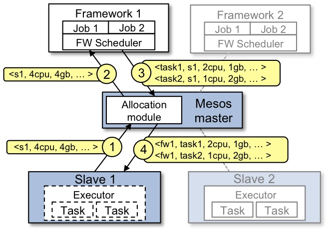



本文根据官网内容介绍描述了mesos的主要组成部分，并通过一个简单示例说明Framework框架是如何通过调度来运行一个任务Task的。

 

---

## Mesos Architecture

官方文档直接了当，一上来就上图，有点别跟我废话，"show me the code"的意味，具有"处女"情结(喜欢获取第一手资料)的小伙伴们可以猛戳[这里](http://mesos.apache.org/documentation/latest/mesos-architecture/)哈。

接下来就开始了跛脚英语的翻译阶段了，并非按原文一板一眼翻译的，但赋予了更多的感情色彩，请小伙伴忍住不要笑。

上图展现了mesos的主要组成部分。Mesos 由一个 master daemon 和多个mesos application(也称为frameworks)组成，其中master daemon主要管理一个或多个承载节点运行的slave daemon, applications则负责在那些slaves上运行任务tasks。

Master 通过使用 resource offers 可更好实现跨应用细粒度资源共享，如 cpu、内存等。 master 根据相关指定的策略来决定分配多少资源给每一个framework ，如公平共享策略，或优先级策略。为了支持多样的策略， master采用热插拔的构件方式实现其架构模块，从而使其更易增加新的插件。

运行在Mesos上的framework由两部分组成：一个是调度器scheduler，即通过注册到master而提供资源。另一个是在slave节点上运行并执行framework的任务task的执行executor 进程。(在http://mesos.apache.org/documentation/latest/下可以查看关于调度和执行相关的更详细的开发向导)。在Master决定为每个framework提供多少资源时，framework的scheduler来具体选择提供的资源。当framework同意了提供的资源，它通过master 将task发送到提供资源的slaves上运行

## 资源供给示例

先上图吧，图比文字描述更清楚。

接下来我们看看这个图在描述啥问题吧。

+ 首先，Slave1向Master说，我这里有4个CPU和4GB内存可用啊，于是Master就掂量下已注册的分配策略模块后，发现这些资源满足了framework1的所有资源请求。

+ 于是，Master发送一个Resource Offer给Framework1，说Slave1那小子有可以利用的4个CPU和4GB的内存啊

+ 接下来，FrameWork1中的办事员FW Scheduler会答复Master，说我现在有两个任务Task需要运行在Slave1，第一个Task需要<2个CPU、1 GB内存>，第二个Task需要<1个CPU、2 GB内存>

+ 最后，Master 发送这些Tasks给Slave1。然后，Slave1还有1个CPU和1 GB内存没有使用。剩下的这些资源怎么分配呢？当然分配模块可以把这些资源提供给Framework2使用。

当Tasks完成和有新的空闲资源时，Resource Offer会不断重复这一个过程。 

(如果你发现看这种资料真的很乏味，请自行准备一个棒棒糖奖励下，因为我准备这么干了。)

当Mesos提供的廋接口允许其来扩展和允许frameworks相对独立的参与进来，一个问题需要留心： 在Mesos对这些限制不知情的情况下，一个framework的限制是如何被满足的？

(原文说得太长了，停下来思考下吧，没看懂好正常。要不咱还是继续吧...)

例如， 在Mesos不知道哪个节点存储着该framework需要的数据时，一个 framework是如何实现数据本地化的？（不要担心）Mesos 通过简单的给予frameworks能够拒绝offers的能力来回应这些问题。 一个framework将拒绝不满足其限制要求的给予操作而接受满足其限制要求的 offers.特别是，我们找到了一个被称为延迟调度的简单策略，在这里frameworks等待一个限制时间来获取存储输入数据的节点，并生成接近的优化过的数据点。

终于啃完了，棒棒糖啊

