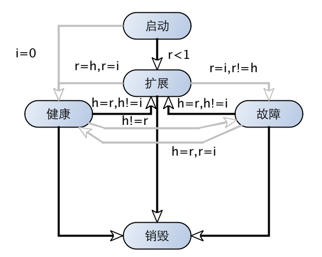



本文主要简要描述marathon的简单示例和相关特性,为在Mesos中使用Docker做准备,行文内容是自己的翻译与中文版
《Mesos 大数据资源调度与大规模容器运行最佳实践》结合。



---

Marathon Web UI界面是一个使用Marathon的很方便的接口。我们可以使其运行一个简单的web server作为一个作业去验证marathon的安装。

创建一个新的应用时，提供这个任务所需要的相关详细资源以及告知如何运行该任务。在ID输入框中输入应用的相关名称。0.1CPU和10MB内存对于我们这个简单任务搓搓有余了。

在命令行一框中，插入如下字符


{ echo -ne "HTTP/1.0 200 OK\r\nContent-Length: 12\r\n"; echo "Hello
World"; } | nc -l -p $PORT



这个命令行通过netcat给浏览器发送了简单的”Hello World”字符串。记录下$POST变量所用的端口。Marathon UI现在应该能看到这个Job的状态了。你能够从Web UI上选择Job的等级(优先级)。与此同时，Mesos Web UI也将显示Marathon jobs运行的相关任务。记录任务运行的主机和端口，以便我们能检查自己的服务。我们也能用Marathon’s REST API 去找到这些信息。完成一个单一请求的响应后命令即完成了执行。

因此，Marathon就是通过每次创建新任务持续保持我们单次请求服务。

Marathon在examples目录下罗列了很多示例任务(在Marathon-0.8.0中罗列的包括Docker.json,Rails.json,Group.json,Tomcat.son,Play.json,bridge.json,PythonSimpleHTTPServer.json,labels.json)。

这里我们可以用Marathon REST API来取代Web接口而启动同样的Job。下面hello_world.json描述了我们刚刚的示例服务。


{
	“id”: “netcat”,
	“cmd”: “{ echo -ne “HTTP/1.0 200 OK\r\nContent-Length: 12\r\n”; echo “Hello World”; } | nc -l -p $PORT”,
	“mem”:10,
	“cpus”:0.1,
	“instances”:1,
}



我们能够通过Marathon REST API使用hello_world.json去运行我们的示例服务。


ubuntu@master:~ $ curl -X POST -H "Content-Type: application/json"
http://master:8080/v2/apps -d@hello_world.json



接下来，我们来看一看Marathon的一些特性

### 约束条件

任何一个调度最想拥有的特征之一就是控制任务在什么地方以何种方式开始。Marathon中的约束条件允许限制特定应用程序运行的位置，因此可以更好的利用位置、容错或其他约束条件来为我所用。启动应用程序的同时哪些约束条件也会被强制执行。一个约束包括字段、运算符及可选的参数。字段是出现在Mesos slave或者其他主机名上的任意属性。Marathon可以通过命令行的—-constraint参数或REST接口上的约束字段来具化约束条件。

我们可以通过如下几种运算符来指定约束条件：

- UNIQUE:表明字段唯一性。比如，在每一个主机上有且只有一个实例/任务。

- CLUSTER:将任务限定到拥有特殊属性的节点上。该运算符在强制本地化非常有用，特别是h/w等。

- GROUP_BY:将任务在已给定字段(racks/数据中心)上平均分配

- LIKE:该运算符允许基于字段里的正则表达式来过滤主机

- UNLIKE:与LIKE相反。它过滤与给定正则表达式不匹配的主机

### 事件总线

Marathon的内部总线能捕获Marathon的所有事件，例如，API请求，伸缩事件等。这个特性可以用来集成负载均衡，监控和与Marathon一起使用的其他外部系统。通过指定--event_subscribe <subscription>在服务器启动时开启该功能。订阅是默认HTTP回调订阅者的插拔式接口。会向--http_endpoint指定的主机通过JSON格式POST发送事件。下述事件会出现在事件总线里：

- API请求（应用程序的创建/修改/删除请求） 

- 每次任务状态改变时接收到的状态更新

- 为每一个框架消息服务的框架消息事件

- 当添加或删除新的事件订阅者时触发的‘事件订阅’事件 

- 由多种健康检查事件触发的健康检查事件，比如增加、删除、故障或状态改变

- 部署事件，为各种部署事件生成，比如，各种各样部署的成功或失败

### artifact store 

artifact store 是部署应用程序使其运行所需的特定资源的位置（存储地），比如特定文件。运行在Marathon上的应用程序可以在其应用定义里使用storeUrls字段。storeUrls是URL的列表。每个URL被下载并存放进artiface store。一旦下载完毕，该artifact的路径就会被添加到应用程序定义里的uris字段下。内容的路径是唯一的，并且不会再次下载，这样能够保证应用更快地运行。artifact store有自己的REST API,允许在artifact上做CRUD(增删改读)操作。artifact API支持通过自动化来简化部署过程。artifact store 能够运行在多种后台存储系统上，包括本地文件系统和HDFS。还可以使用参数--artifact_store 来配置Marathon使其使用artifact store,该参数提供artifact store 的位置路径。需要注意的是，artifact store的所有功能都可以在没有artifact store的情况下手动完成，因此，artifact store的使用也是可选的，非必选项。

### 应用组

应用组将应用分为互斥的交集以便管理。组使得管理逻辑上相关的应用程序变得简单，并且允许在整个组的范围内执行像扩展这样的操作。比如，将组扩展两倍会将该组的所欲应用都加倍。组可以包括应用程序或者组。组是分层的，可以用相对或绝对路径来表示。因此组是可以由组组成的。下面是组定义的示例。


{
    "id":"/product",
    "groups": [
        {
            "id":"/product/db",
            "apps":[
                {"id":"/product/mongo",...},
                {"id":"/product/mysql",...}
            ]
        },{
            "id":"/product/service",
            "dependencies":["/product/db"],
            "apps":[
                {"id":"/product/rails-app",...},
                {"id":"/product/play-app",...}
            ]
        }
    ]
}



Marathon 在启动、停止、升级及扩展时会考虑依赖关系。依赖关系可以定义在应用程序或者组级别上。定义在组级别的依赖关系适用于该组的所有成员(组或应用程序)。

### 应用程序健康检查

对于长期运行的服务而言，详细的健康检查功能必不可少。Marathon的默认健康检查任务认为只要Mesos任务的状态为TASK_RUNNING,其应用状态就是健康的。这样简单逻辑的健康检查对于简单应用来说可能已经足够了，但是很多应用程序都有不同的语义来定义何时认为其状态是健康的，以及何时需要重启。Marathon里的应用程序生命周期如下图所示，图中i是请求的实例个数，r是运行着的实例个数，h是健康的实例个数，箭头上的标签说明在哪种条件下会触发状态间的转变。

在任务启动时，健康检查就会立即随之启动，但是会忽略初始故障gracePeriodSeconds。如果在maxConsecutiveFaliures之后任务还不在健康状态，该任务就会被强行终止。目前Marathon支持HTTP和TCP健康检查，其他选择仍在开发中。

 
