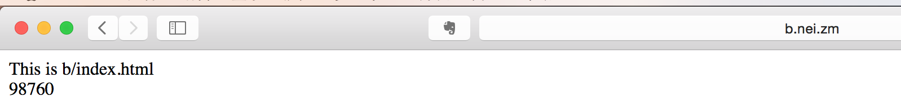



本文结合项目组实际需求，主要描述采用nginx正则表达式通过定义内部变量实现二级域名映射到
不同物理路径目录的过程。

 

---

## 需求

目前公司接到的电商项目越来越多，这些需求中大多都有新增门店的情况，且各个门店希望有自己对应的二级域名。即当客户访问主域名时，比如www.nei.zm,能解析到公司主页内容的页面上；当客户直接输入a.nei.zm时，希望能解析到门店a的主页内容的页面上；当客户直接输入b.nei.zm时，希望能解析到门店b的主页内容的页面上；如何利用nginx实现该应用需求？

---

## 解决方案

采用nginx正则表达式通过定义内部变量实现二级域名映射到不同物理路径目录的过程。

---

## 详细步骤

### 测试环境



操作系统：Mac OS X Yosemite 10.10.3
nginx版本: nginx version: nginx/1.9.3
web服务器： apache-tomcat-6.0.44
(这里省略了Unix安装nginx及Tomcat的步骤)



### 修改hosts内容

在/etc/hosts文件中增加如下几行内容



127.0.0.1  nei.zm
127.0.0.1  www.nei.zm
127.0.0.1  a.nei.zm
127.0.0.1  b.nei.zm
这里以nei.zm及其子域名作为访问对象



### 增加测试内容

在$TOMCAT_HOME/webapps下创建zm目录及子目录a、b,同时在三个目录下创建内容不同的index.html文件,如图所示：

### 配置/usr/local/nginx/conf/nginx.conf文件



server {
    listen       80;
    server_name  localhost;
    #二级域名不同访问不同子目录
    set $subdomain '';
    if ( $host ~* (\b(?!www\b)\w+)\.\w+\.\w+ ) {
        set $subdomain /$1;
    }
    
    location / {
        if ($subdomain != '') {
            proxy_pass http://127.0.0.1:8080/zm/$subdir/index.html;
        }
        #index  index.html index.htm;
        proxy_pass http://127.0.0.1:8080/zm/index.html;                                                                                                              
    }
    
    error_page   500 502 503 504  /50x.html;
    location = /50x.html {
        root   html;                                                                                                                                                      }
}




### 测试内容

(1)访问a.nei.zm如图所示

(2)访问b.nei.zm如图所示

(2)访问www.nei.zm或nei.zm如图所示

