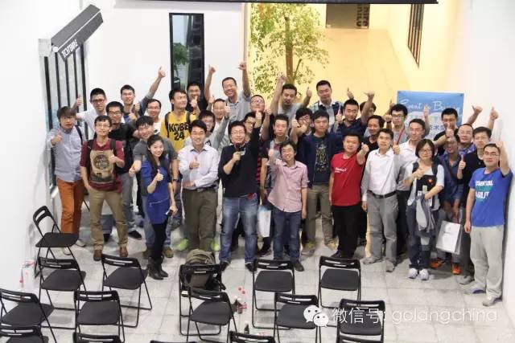



本文主要描述了自己与一个终端工具iterm2的一点故事，回看整个小故事，觉得值得一写，一方面能更多记住iterm的快捷键，
另一方面觉得它对自己看事情的角度也有一些触动。

 

---

## 与iTerm相识

早在几年前，就有同事推荐自己在终端可以使用iterm这个工具去处理事务，简单而方便。当时觉得系统自带终端也挺棒的，每每口里答应，但却鲜有行动。

## 与iTerm交手

随着使用终端快捷键的不断熟练，更多的快捷键不是背下来了，而是两个手指的感觉，慢慢地有同事时不时问问我一些终端快捷键的常用命令。每次在我的终端演示完之后，他们一试就叫唤，“那谁谁谁，你刚说的快捷键不好使呀！”。于是我信心满满地跑过去一试，NND，真不好使，这是为啥? 同样的黑色画面，长得也不多一个鼻子眼睛，就是不好用。仔细看看我知道了，我俩用的终端不同，人家用的是iterm,于是大声告诉它，换自带终端吧或者查查iterm的快捷键，有时候心里还暗自窃喜，你看我用自带终端不是挺好的么，用什么iterm？可见自己的狂妄和狭隘。

下图是分屏幕窗口的截图

## 与iTerm想知

在今年9月的一个golang聚会上，看见一位讲师，熟练的打开终端，并敏捷地将其分为多个分区，每个分区不仅大小相等而且整个屏幕显得多姿多彩,漂亮极了。当时还特不好意思问，怕露怯，尽管心里暗暗惊喜，但仍面不改色。聚会结束后，马上装了一个，几经练习，感觉太顺手了。

下图是当时聚会的一些图片，感谢聚会的组织者和分享的各位讲师。

## 与iTerm相恋

据我了解，很多行业内的大牛们不仅知识面广，更具敏锐的判断力和强大地实践精神，他们都是很多工具的高级用户，与此同时还积极参与开源，为正版软件付费，身体力行，是我学习的榜样。我们现在这个时代有很多提升工作效率的工具，我们用到的却少之有少。现在每天我打开电脑使用终端时，都会毫不犹豫的打开iterm,偶有打开自带终端时，也是Ctrl+q迅速将其关闭。最后，希望自己能成为iTerm和Vim的高级用户,成为充满速度感全键盘手。

## iTerm相关快捷键

- 基本功能


分切窗口: shift+command+d(横向)command+d(竖向)
关闭窗口: command + w
切换窗口: command + [ 或 ]
新建tab: command + t
切换tab: command + 数字 或左右箭头
查找与粘贴：command+f，呼出查找功能，tab 键选中找到的文本，option+enter 粘贴
粘贴历史：shift+command+h5、回放功能：option+command+b
全屏：command+enter
光标去哪了？command+/
换到新一屏:command + r

共有特性：
清空当前行: ctrl + u
清空当前窗口内容:command + k
自动补全命令: command + ;
列出剪贴版历史:command + shift +h
到行首 : ctrl + a
到行尾 : ctrl + e
退出iterm : ctrl+q
删除光标前字符: ctrl + h
删除光标前单词: ctrl + w




- 下载地址
[iterm官网链接](http://iterm2.com/)

