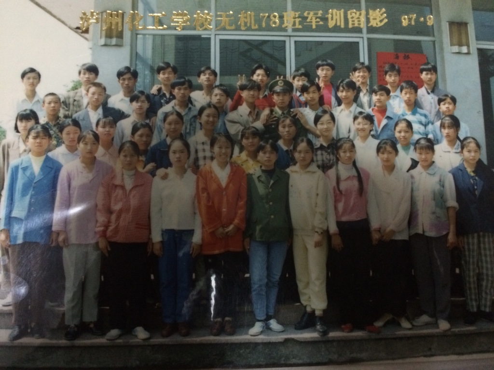
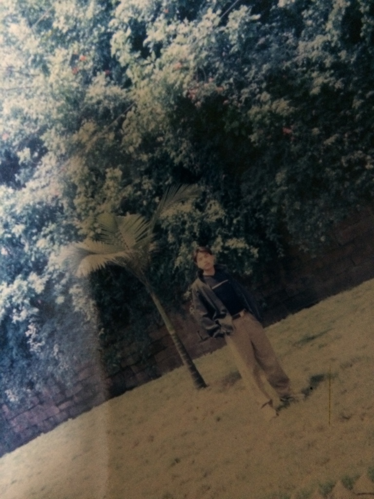
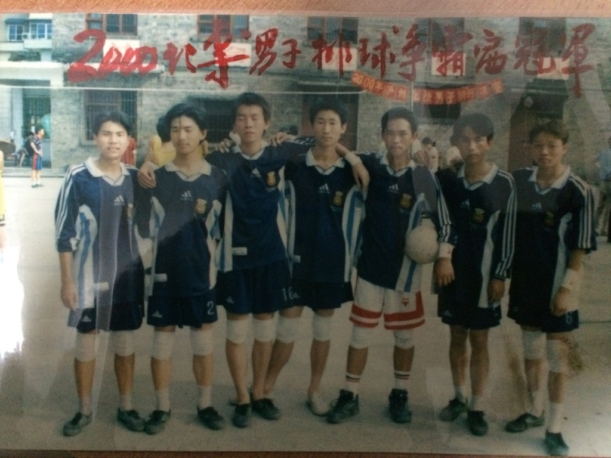
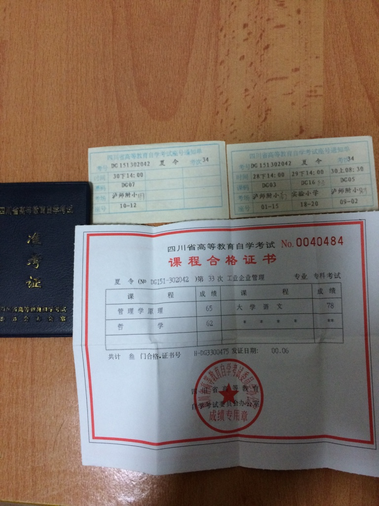
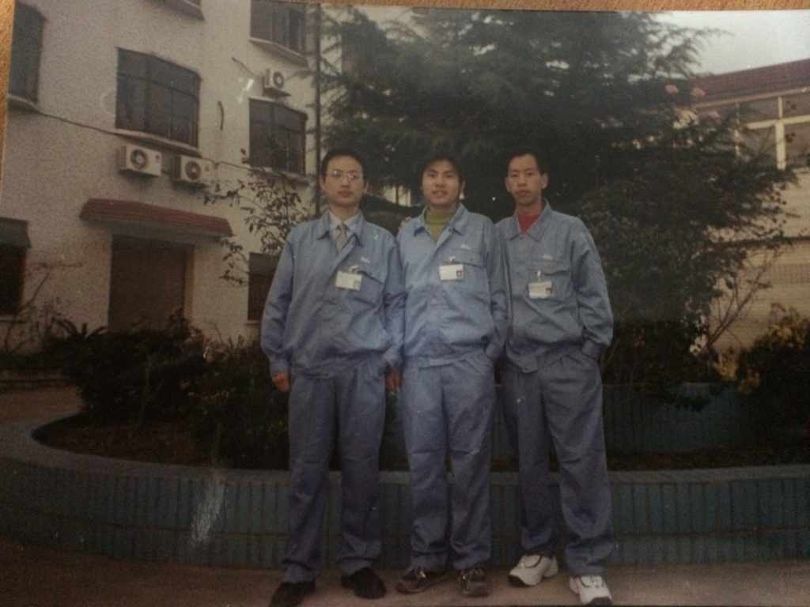
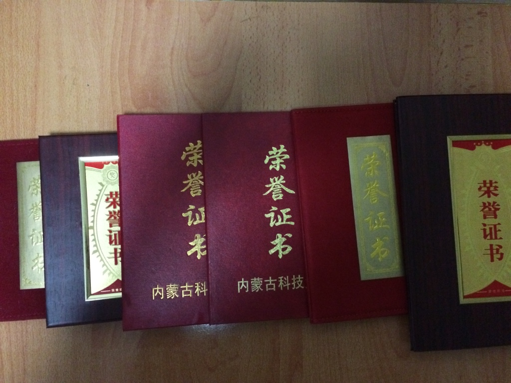



最近自己在整理一些老旧东西，也正好想聊一聊25岁之前我的干了些啥，因为每次写简历的时候，都会觉得25岁大学毕业是一件不光彩的
事，但从内心坚定地认为自己的选择是正确的，因为我的求学之路与大多数同学不一样。

 

---

## 超生的农民

我出生在四川省东部地区的普通农村，父亲是当年从镇上下放的知青，母亲则是大队当时宣传队的骨干，最初他们响应党的号召，生了一个男孩，高高兴兴领了独生子女证，但这个男孩不是我，是我哥。后来觉得一个小孩在农村成长太孤单，于是有了我。有了我之后，独生子女证及相关待遇均被取消，还被罚了款。由于我爸是知青，属于城镇户口，所以按政策可以给一个小孩上城镇户口，于是我哥顺利登记在城镇户口行列，我则跟母亲上了农村户口。在印象中，当年城镇户口和农村户口是有明显区别的，城镇户口应该不上交公粮了吧，但我们小孩子根本没啥感觉，到处跑到处玩。现在农村户口不仅不上交公粮还有各种补贴，所以好多人还千方百计想转为农村户口，我觉得有这种想法的人是可耻的，是为了钻政策的漏洞，迟早得不偿失。现在看多了听多了，才觉得户口这事本身就值得商榷。

## 在调皮捣蛋过程中度过小学

记得5岁左右的时候，我家搬到了镇上，我哥上的小学就离家不到20米，我觉得好玩就跟着去上，第一节课就被老师教育，从此也不再进他们教室了，没事的时候会爬在窗口上看他们上课。到了我该上小学的时候，适龄小学只有一所，每天上学必须穿过整个镇的主要街道，所以每天母亲都会嘱咐一阵。隐约记得小学有一年，因为看别人打架，不小心踩到了别人刚松的土，最外层的黄橙色毛衣被没收了，后来经过父母交涉才拿回来。非常深刻地记得，母亲经常用哥哥取得的成绩鼓励我，比如哥哥某次数学考试获得了全区第一，让我跟着学，所以他一直都是我学习的榜样。直到小学快毕业了，我才拿回了属于自己的第一张奖状，现在还记得拿回奖状时，母亲高兴地样子和不断的鼓励，应该说就是这些鼓励，让我在初中不断努力。但后来有次聊起这事，她老人家已经忘记了，可见对孩子适当的鼓励是多么的重要。

## 初中的小得意 

在小升初的过程中，一下考到了全镇前列，尽管全镇加起来同班也就100多个孩子，但这大大激励了自己的学习动力。有时候适度优越感会让自己感觉很自信。在接下来的几年学习中，每年期末考试都会得到一张奖状，慢慢地我家的一面墙壁都快被我哥和我的奖状貼满了，常有路过家门看见奖状的人，都跟父母赞扬我们一番。时间慢慢到初三，面临着人生的第一次选择，由于我们镇上当时的风气主要是考中专和中师两种，所以我也沿着哥哥的路子考取了中专统招,在当年统招还是包分配工作的。这在后来看来，决策是错误的.这种想法局限了自己更大的发展，得到的是摆脱了农村户口，有一个简单的工作而已。

## 情窦初开的中专生活

1997年8月初，录取我的学校是四川省泸州化工学校(现更名为四川化工职业技术学院)无机化工专业，当时她还属于国家级重点中专，毕业生能到西南各大重点化工企业就业，这对于出生农村的我们有极大的吸引力。9月初，父亲送我去学校报到，心里还特别美，一个班49个人中，只有4个同学是统招，不仅学费少了很多，而且每月还有28元的生活补贴(后来上大学才每月23元)。特别是大家都很纯真和善良，还有校园里一下有了太多美女了，感觉太幸福了，特别是当心仪的女孩就在你前排，除了节假日外每天做早操，上晚自习也觉得很好。后来有同学退学去参加高中复习，当时还觉得好傻(现在觉得当时自己目光好短浅)。几年中发生了很多有趣有意思的事，很多时候想起来整个中专生活都是美好和值得回忆的。

下面是很多当时的照片

## 去化工厂上班

2000年中下旬，尽管我们是4年学制，但各大企业依旧早早开始来学校招人，传统招人企业有云天化，希望集团，宜宾天元等。但也有例外，就在那年冬天，一个上海的化工厂(上海蓝水化工股份有限公司)老板来了学校，有机专业、分析专业、仪表专业及无机化工专业的一批学习优秀的学生被集中到一个教室，等待被挑选。这次共选中了12个学生，包括我和同班另外两个统招生。在快要离开学校的时候，看到广告宣传栏光荣榜把我们写了进去。

后来，12个小朋友就踏上了开往上海的火车，在火车上还为一个同学过生日，于是火车的行驶声和我们稚嫩的生日歌声交织在一起。第一次去上海，心里也很开心，沿途风景，着实让我感觉到江浙的富饶。到了上海后，就坐上厂里安排的车直接送到了厂区宿舍。这一年，我们都是在上海过的除夕，12个人也很团结，没事的时候，骑上自行车出去转转，到中学打篮球，在宿舍打双升扑克。这一切看来都很美好。

由于在中专时，自己已经过了自考的很多科了，还有约5科就可以拿到大专文凭了，本以为可以在上海延续之前的考试，但就是不行，即便这样，我和同班的另一名同学还坚持报了自考，从零开始，这在后来发现当时太过于盲目乐观。

2000年农历新年过后，我们被分配到第二车间不同组进行24小时倒班工作，带我们的有不同的师傅，我对陈师傅、龚师傅的印象很好，加上之前对我们很好的朱师傅，我们觉得尽管听不懂上海话，也感觉不到“上海人排外的气氛”。随后不久传来大伯去世的消息，大伯是很关心我哥俩的，当时心里非常难受，就只能在没人的时候对着厂区后面小河狂喊,发泄发泄。唯一值得欣慰的是，他在临终时已知道我在上海上班了。（大伯请安息吧，我已定居北京，并在北京成家了)

在厂里上班的时间越长，就越能体会到上晚班的辛苦，整个生物钟都是颠倒的，慢慢感觉现实并非如想象来得美好，开始为自己以后要走的路进行思考了。与我不谋而合的是，同去的12个同学中大部分都开始担忧自己未来的发展。2001年6月，我们获得了毕业证书，但随后不久我班一位较为有经济头脑的同学就离开了厂子，这也导致了我们内部不同思潮的涌动，有人提出要回去读书，有人提出回家做事等。2001年9月11日，那天我们还在上班，就听说美国世贸中心两栋楼被飞机撞了，当时还并未意识到是被袭击了，觉得这么强大的美国怎么能出这种事呢？此时，12人中只剩下了包括我在内的6人。走的人中不想回来的人多，但也有极个别人还想回到厂里。

后来一段时间里，我和另一位同学探讨以后的发展方向，经常不知不觉就到了凌晨2，3点。最后我们的决定是，只有考取大学，才能继续不断前行，但我们的观点略有不同，他希望若能从高二开始读，最为妥当，而我觉得只要自己努力点，直接从高三开始读也没什么问题，毕竟我们已经比高三学生的年龄大了（这里也间接证明了他比我的高明）。想法确定后，与家里父母商量，我先他于2001年9月25号回到重庆，几经周折才直接插入重庆二十九中进行学习。

## 真实的高三

进入高三学习后，不仅要自学高一高二的课，还必须跟上高三的课，那一年，我确实是在与时间赛跑，每天披星戴月很习以为常(以至于后来在软件行业的连续38小时加班也没觉得有什么问题)。尽管如此，除了语文，其他科目几乎很难达到90分的及格线。付出和收获极不成正比，从始至终，上大学的信念也未在我心底被浇灭，并且坚信一年足已改变一个人的一生，直到最后一次摸底考试，我的成绩有了大幅提升，几乎从最后几名蹦到了中游地带，把老师和同学吓了一跳，因为在我的考场里除了全校最后几名就是非渝户籍的学生，绝无抄袭的可能性。

中国的高考跟政府宣扬的主义是一样的，都具有中国特色，只有回到户籍所在地才能参加高考，也就是说，我必须回到四川的县城才能有资格参加高考，这下让我很为难，是否能参加2002年高考还都是未知数。经过很多努力后，在政策的允许下，终于我以高三复习生的身份有资格走上考场了，这次考试也是我这一年考得最好的一次，当时的分数超过重庆的录取线近60分，但同样的成绩也只是刚过了四川二本的统招线。在我收到包头钢铁学院(2003年更名为内蒙古科技大学)录取通知书时，我知道这是我新的希望，里面包含着这一年来很多人的帮助，直到今天想来也非常感动。

那一年很多事值得我记住和感恩，还有一些事在不断激励我向前努力。

## 勤奋上大学但眼光狭隘

上大学后，自己如鱼得水，从2002年到2006年，一直很努力的完成学业，每学期都是学习一等奖学金，多次社会活动二等奖学金，到毕业时综合分数排名整个专业第二名。下图是我获得的部分证书。

即便是这样，到找工作时，也遇到一些困难，因为学的内容与公司要求掌握的差别较大，至少部分公司更希望招一些培训学校出来的人因为更容易干活。现在参加一些技术活动时，经常能看见在校学生的身影，都会觉得他们真的很了不起，他们的眼界是开阔的，至少不固步自封。

毕业时我快25岁了。

## 寄语未来 

回首这些年，有得有失，希望有一天，我再回看这篇文章时，仍能激励自己，因为最苦的时间已悄然过去。

每一次选择都很重要，但自己的选择一定会遵从我心。

