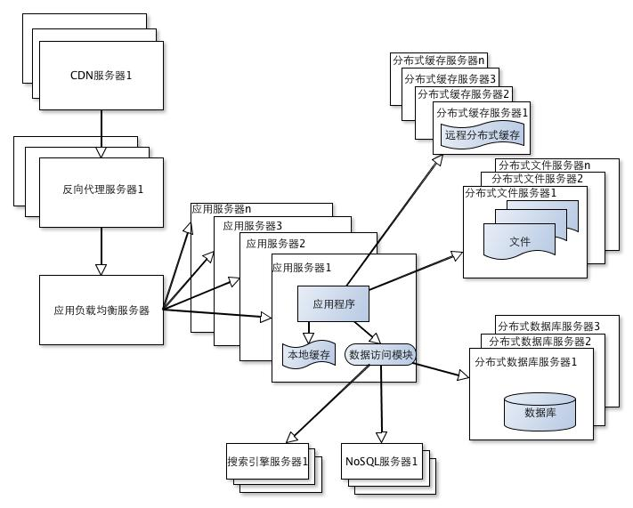



最近阅读了李智慧著的《大型网站技术架构：核心原理与案例分析》部分内容，觉得作者深入浅出地讲述了网站技术架构的演进过程，
从文字中似乎能看到自己曾经的思考和影子，故特做此笔记，与大家共勉

 

---

## 网站初期架构

几乎所有的大型网站都是从小型网站发展而来的，网站架构也一样，是从小型网站技术架构逐步演化而来的。小型网站最开始没有太多访问量，可能只需要一台服务器就能够应付了，这时的网站架构如下图所示。

即将应用程序、数据库、文件等所有的资源都在同一台服务器上。很多时候，是汇集免费开源软件及廉价服务器开始的，例如:Linux+PHP+Apache_Mysql.

## 应用服务与数据服务分离

随着网站业务的发展，用户多了，导致性能越来越差，越来越多的数据导致存储空间不不足，一台服务器再也不能满足需求了。于是将应用与数据进行分离，如下图所示。

有个架构经验的同学应该知道，这三台服务器对硬件资源的要求会各不相同，应用服务器需要处理大量业务逻辑，因此需要更快更高频的CPU；数据库服务器需要快速磁盘检索和数据缓存，因此需要更快的硬盘和更大的内存；文件服务器需要存储大量用户上传的文件，因此需要更大的硬盘。

## 使用缓存改善网站性能

随着用户数量逐渐增多，只是简单的将应用与数据分离的架构会出现数据库压力太大导致访问延迟，从而影响整个网站的性能。一般企业都会对用户的行为数据进行分析，我们这里主要从访问量整个角度去解读，即80%的业务访问集中在20@的数据上。例如：淘宝买家浏览的商品集中在少部分销量多、评价良好的商品上；百度搜索关键词集中在少部分热门词汇上；只有经常登录的用户才会发微博、看微博，这些用户只占总用户数目的一小部分。

有了整个结论，解决办法也就有了。既然大部分的业务访问集中在一小部分数据上，如果我们把这些经常使用的数据缓存起来，提高命中率，应该就可以减少数据库的访问压力，提高响应速度。

网站使用的缓存分为两种，一种是缓存在应用服务器上的本地缓存，另一种是缓存在专门的分布式缓存服务器上的远程缓存。理论上，前者访问速度更快，但受限于应用服务器内存限制，所以缓存数据量有限，而且会出现它和应用程序争用内存的情况。远程分布式缓存(例如：memcache)可以使用集群的方式，部署大内存的服务器作为专门的缓存服务器，在理论上可以做到不受内存容量限制。根据这想法，网站技术架构如下图所示。

使用缓存后，数据访问压力有明显缓解，但是单一应用服务器能够处理的请求连接也有限，在网站访问高峰期，应用服务器就成为了整个网站的瓶颈。

## 使用应用服务器集群改善网站的并发处理能力

我们知道，使用集群是网站解决高并发、海量数据问题的常用手段。当一台服务器的处理能力存储空间不足时，用一台强劲的服务器取代原服务是治标的办法，治本的办法应该是用多台普通服务器去分担原有服务器的访问及存储压力。当然，这其中就需要解决session同步，负载均衡(策略、方法)、心跳检测等诸多技术问题。通过多台服务器提供持续动态服务从而实现系统的高可用及可伸缩性。自己曾经实现的集群方案就使得公司欧美部门在某项目竞标过程中顺利通过第三方独立测试。网站技术架构如下图所示。

通过负载均衡调度服务器，可以将访问请求分发到集群终端任何一台应用服务器上，如果用户数量仍不断攀升，就可以在集群中平滑地加入更多的应用服务器，使应用服务器的负载压力不再成为整个网站的瓶颈。

## 数据库读写分离

网站在使用缓存后，使绝大部分数据读操作访问都可以不通过数据库就能完成，但仍由一部分读操作（例如：缓存访问未命中或缓存过期）和全部的写操作需要访问数据库，因此当网站的用户达到相当规模后，数据库因为负载压力过高就可能成为网站的瓶颈。

目前大部分的主流数据库都提供主从热备功能，通过配置两台数据库主从关系，可以将一台数据库服务器的数据更新同步到另一台服务器上。网站利用数据库的这个功能实现数据库读写分离，从而进一步改善数据库负载压力。网站技术架构如下图所示。

从上图可以看到，应用服务器在写数据时，通过数据访问模块，访问主数据库，主数据库通过主从复制机制将数据更新同步到从数据库，这样当应用服务器读数据的时候，就可以通过从数据库获得数据。其中，数据访问模块是为了使数据库读写分离对应用透明。

## 使用反向代理和CDN假设网站响应

经过上述几个技术演进，应该说能够满足大部分网站性能需求，但是，你要知道，咱们国家目前有多少互联网用户，即便12306这种网站也架不住超大用户的同时访问，而且由于咱们国内复杂的网络环境，不同地区的用户访问网站时，速度差别也极大。如果王文一个网站时，经常出现很慢，必然造成用户体验差的反响，进而影响业务发展。所以，在害怕超大用户集中访问时，还需要想办法留住用户，怎么办呢？这就需要加速自身网站的访问速度，主要方法有使用CDN和反向代理两种方法。

CDN的全称是Content Delivery Network（内容分发网络），主要含义是指将请求分配到离自己最快的服务器。

CDN和反向代理的基本原理都是缓存，区别在于CDN部署在网络提供商的机房，使用户在请求网站服务时，可以从距离自己最近的网络提供商机房获取数据；而反向代理则部署在网站的中心机房，当用户请求到达中心机房后，首先访问的服务器是反向代理服务器，如果反向代理服务器中缓存着用户请求的资源，就将其直接返回给用户。此时网站技术架构变为下图所示。

使用CDN和反向代理的目的都是尽早返回数据给用户，一方面加快用户访问速度，另一方面也减轻后端服务器的负载压力。

## 使用分布式文件系统和分布式数据库系统

从目前大型网站(典型的是电商网站)看，任何强大的单一服务器都满足不了大型网站持续增长的业务需求。尽管数据库经过读写分离，且变为两台，但纷繁复杂的业务仍在蓬勃发展，这时若进一步优化，则需要使用分布式数据库。文件系统使用分布式文件系统。此时网站技术架构变为如下图所示。

到目前为止，分布式数据库是网站数据库拆分的最后手段了，只有在单表数据规模非常庞大的时候才使用。不到不得已时，网站更常用的数据库拆分手段是业务分库，将不同业务的数据库部署在不同的物理服务器上。

## 使用NoSQL和搜索引擎

看这本书时，你经常会看到随着网站业务越来越复杂这样的文字，一般读者或许真不知道有多复杂的业务才会搞出上述那么牛X的架构之后还会有优化的空间。可能还有一部分读者读到这里，就直接跑去最后，看看它最终的架构长什么样子。我读到这里还好，不是很被虐，因为我碰到过，知道技术这东西真能解决很多事。

一个网站的响应效率高低是用户体验好坏的重要指标之一。用户对数据存储和检索的需求越复杂，就要求网站采用一些非关系数据库技术(例如NoSQL)和非数据库查询技术(例如搜索引擎)了。如下图所示。

NoSQL和搜索引擎都是源自互联网的技术手段，对可伸缩的分布式特性具有更好的支持。应用服务器则通过一个统一数据访问模块访问各种数据，减轻应用程序管理诸多数据源的麻烦。

## 业务拆分

大型电商网站为了应对日益复杂的业务场景，还通过使用分而治之的手段将整个网站业务分成不同的产品线交由不同的业务团队负责，例如首页、商铺、订单、买家、卖家等均为不同产品线。

从技术上而言，会根据产品线划分，将一个网站拆分成许多不同的应用，每个应用独立部署维护。应用之间可以通过超链接建立关系，还可以通过消息队列(例如:RabbitMQ,Kafka,ActiveMQ或Apollo)进行数据分发,最多的还是通过访问同一个数据存储系统来构成一个关联的完整系统。这里典型的架构是SQA的场景。WebService及SOA的架构也会出现服务太多过乱的情况，后来有引入Dubbo和ZooKeeper来进行服务治理和发现的。如下图所示。

## 分布式服务

当业务拆分越来越小，存储系统越来越大，应用系统的整体复杂度呈指数级增加，部署维护越来越困难。由于所有应用要和所有数据库系统连接，在数万台服务器规模的网站中，这些连接的数目是服务器规模的平方，导致存数据库连接资源不足，拒绝服务。

既然每一个应用系统都需要执行许多相同的业务操作，比如用户管理、商品管理等，那么可以将这些共用的业务提取出来，独立部署。由这些可复用的业务连接数据库，提供共用业务服务，而应用系统只需要管理用户界面，通过分布式服务器调用共用业务服务完成具体业务操作。如下图所示。

在这些架构演进过程中，大多数技术问题都可以得到解决，类似跨数据中心的实时数据同步和具体网站业务相关的问题也都可以通过改进现有技术架构来解决。

大型网站架构解决了海量数据的管理和高并发事务的处理，也可以将这些解决方案应用到网站自身以外的业务上去。目前很多大型网站都开始建立云技术平台，将计算作为一种集成资源出售，让中小网站不需要再关心技术架构问题，而只需按需付费，就可以获得更大存储空间及计算资源。
