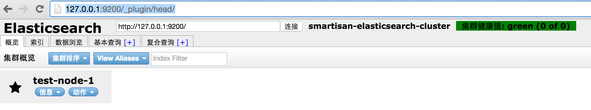
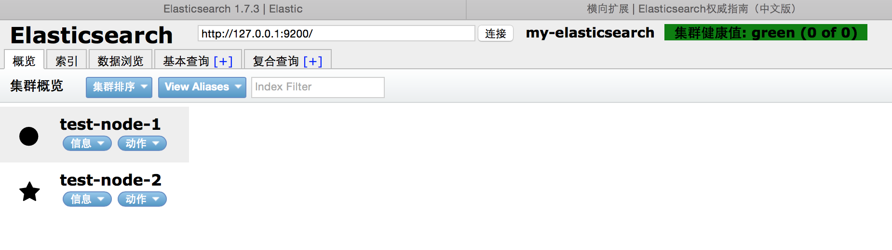
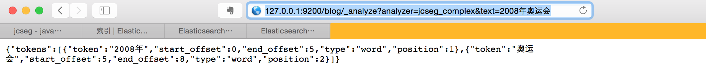
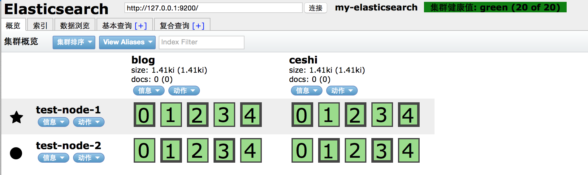



最近接到搭建带分词功能的搜索框架环境需求，该架构需要很好的平衡搜准率，搜全率及能支持扩展词库等
功能，选择了ElasticSearch+Jcseg来实现。

 

---

#### 注意事项

elasticsearch的版本，建议使用1.7.3,如果用2.0.0版本，会出现使用head插件时，无法发现同网段同名cluster下各结点.

#### 下载elasticsearch并解压

从 这里https://www.elastic.co/downloads/elasticsearch 下载elasticsearch-1.7.3.tar.gz

解压 tar -zxvf elasticsearch-1.7.3.tar.gz

【可以使用 mv elasticsearch-1.7.3 elasticsearch-node1 为了做集群方便,这里假定ES_HOME=/usr/local】

#### 修改ES_HOME/config/elasticsearch.yml文件


# elasticsearch-node1配置
# 配置集群名称
 cluster.name: elasticsearch-cluster-linux
# 配置节点名称
 node.name: "es-test-node1"
# 为节点之间的通信设置一个自定义端口(默认为9300)  
 transport.tcp.port: 9300
#设置监听HTTP传输的自定义端(默认为9200)
 http.port: 9200 
#是否有资格被选举为master，es默认第一个为master 
 node.master: true
#指定该节点是否存储索引数据，默认为true
 node.data: true
#设置索引分片个数，默认为5
 index.number_of_shards: 5
#设置索引副本个数，默认为1
 index.number_of_replicas: 1
#true为锁定内存，防止swapping时效率降低，可以将ES_MIN_MEM和ES_MAX_MEM两个环境变量设置成同一个值
 bootstrap.mlockall: true
#设置内容的最大容量 
 http.max_content_length: 10mb
#是否使用http协议对外提供服务
 http.enabled: true
#默认为local即为本地文件系统，还可以为分布式文件系统，hadoop的HDFS，和amazon的s3服务器
 gateway.type: local

 

#### 单机运行测试


进入ES_HOME/bin,执行./elasticsearch -d 
就可以在浏览器中输入http://127.0.0.1:9200去看到,则表明已经运行

{   "name" : "es-test-node1",   "cluster_name" : "elasticsearch-cluster-linux",   "version" : {     "number" : "2.0.0",     "build_hash" : "de54438d6af8f9340d50c5c786151783ce7d6be5",     "build_timestamp" : "2015-10-22T08:09:48Z",     "build_snapshot" : false,     "lucene_version" : "5.2.1"   },   "tagline" : "You Know, for Search" 
}

 

#### elasticsearch 集群搭建

因为ElasticSearch原生就是支持集群的，启动单个es节点也是集群，每个集群都有一个名称，默认的集群名称为elasticsearch，这里改为了elasticsearch-cluster-linux。同样每个elasticsearch节点也都有名称，可以在ES_HOME/config/elasticsearch.yml中指定node.name.如果不指定，ElasticSearch会从自己的配置文件中随机选出一个作为自己的名称，如果启动节点时想指定集群名称和节点名称，使用一下命令进行启动
/elasticsearch --cluster.name <集群名称> --node.name <节点名称>

我们需要通过head插件来实现


进入ES_HOME/bin文件夹
./plugin --install mobz/elasticsearch-head
【插播广告：这里一定要注意，如果使用2.0.0版本的话，安装方法为./plugin install mobz/elasticsearch-head,而且会出现如下问题
可能出现以下问题：
Verifying https://github.com/mobz/elasticsearch-head/archive/master.zip checksums if available ...
NOTE: Unable to verify checksum for downloaded plugin (unable to find .sha1 or .md5 file to verify)
Installed head into /home/gap/software/elasticsearch-2.0.0/plugins/head

这种情况没关系，不要按网上内容去处理了（比如，通过./plugin -install mobz/elasticsearch-head
或者plugin install mobz/elasticsearch-head 或者./plugin --install mobz/elasticsearch-head 在bin下面有一个plugins文件等），估计跟elasticsearch版本有关系
】

直接在bin中启动./elasticsearch -d

 

就可以在浏览器中通过http://127.0.0.1:9200/_plugin/head/就可以看到如下界面了

接下来我们来搭建多个node


将ES_HOME/elasticsearch-node1 拷贝一下变成elasticsearch-node2
cp -r elasticsearch-node1 elasticsearch-node2

修改elasticsearch-node2/config/elasticsearch.yml文件
# elasticsearch-node1配置
# 配置集群名称
 cluster.name: elasticsearch-cluster-linux （！！！这里与第三步保持一致，集群就靠它了）
# 配置节点名称
 node.name: "es-test-node2"
# 为节点之间的通信设置一个自定义端口(默认为9300)  
 transport.tcp.port: 9301
#设置监听HTTP传输的自定义端(默认为9200)
 http.port: 9201 

 

然后分别启动两个节点并在浏览器中进行查看，如下图所示

#### 将中文分词Jcseg插件加入到Elasticsearch

1.jcseg分词安装


jcseg版本选择1.9.6

Jcseg开发帮助文档中对于Elasticsearch分词插件集成是如下描述的：
a.下载最新版本的Jcseg源码
b. 使用maven或者ant编译打包得到
c.拷贝jcseg-analyzer-1.9.6..jar,jcseg-core-1.9.6.jar,jcseg-elasticsearch-1.9.6.jar到{ES_HOME}/plugin/analysis-jcseg目录下(需要自己创建这个文件夹)
d. 拷贝一份 jcseg.properties 到{ES_HOME}/config/jcseg 目录下(自己建立文件 夹)
e. 配置好 jcseg.properties,尤其是配置 lexicon.path 正想正确的词库(可选,如果 身略步骤 4,则 jcseg 按照先前上面的说自动搜寻 jcseg.properties 配置文件初始化选项) 6. 参考下载的源码中的 jcseg-elasticsearch 项目下的 config/elasticsearch.yml 配置文件,将对应的配置加到{ES_HOME}/config/elasticsearch.yml 中去
f. 配置 elasticsearch.yml 或者 mapping 来使用 jcseg 分词插件(或者在 query 中指 定):



2.配置elasticsearch

建议git clone http://git.oschina.net/lionsoul/elasticsearch-jcseg

拷贝elasticsearch-jcseg/config/jcseg到{ES_HOME}/config/下

拷贝elasticsearch-jcseg/plugins/analysis-jcseg到{ES_HOME}/plugins/下

修改{ES_HOME}/config/elasticsearch.yml，增加如下内容,一定要注意空格，否则你会后悔的


index:
   analysis:
          
          tokenizer:
            jcseg_complex:
              type: jcseg
              seg_mode: complex
            jcseg_simple:
              type: jcseg
              seg_mode: simple
            jcseg_detect:
              type: jcseg
              seg_mode: detect

          analyzer:
            jcseg:
              alias:
              - jcseg_analyzer
              type: org.elasticsearch.index.analysis.JcsegAnalyzerProvider
            jcseg_complex:
              type: custom
              filter:
              - lowercase
              tokenizer: jcseg_complex
            jcseg_simple:
              type: custom
              filter:
              - lowercase
              tokenizer: jcseg_simple
            jcseg_detect:
              type: custom
              filter:
              - lowercase
              tokenizer: jcseg_detect

 index.analysis.analyzer.default.type : "jcseg"

 

3.建立索引

可以采用两种方法建立索引，索引名称可以自定义。
一种是通过http://127.0.0.1:9200/_plugin/head/上web页面上创建索引
另外一种方式可以在命令行中输入curl -XPUT http://127.0.0.1:9200/ceshi,或者curl -XPUT http://127.0.0.1:9200/blog，这样就建立ceshi及blog索引

4.测试

在浏览器输入http://127.0.0.1:9200/blog/_analyze?analyzer=jcseg_complex&text=2008年奥运会,就可以看到拆分的效果了

在浏览器输入http://127.0.0.1:9200/ceshi/_analyze?analyzer=jcseg_complex&text=2008年奥运会,也可以得到以上效果

5. 集群整体情况

6. 如何扩展词库

jcseg可以自定义词库，在 lexicon 文件夹下,可以随便添加/删除/更改词库和词库内容,并且对词库进行了分类。

###### 新建词库文件

(1).lexcion.path+lexicon.dir目录下新建一个以utf-8编码的文件，重命名为lexicon.prefix****.lexicon.suffix，如果采用默认值的话就是：lex**.lex，例如我想引入一个常用品牌的词库，建立一个lex-pingpai.lex的文件即可。

(2).给上一步新建立的词库分类：请查看word.type文件，在词库的第一行加入词库类别关键字即可。可以查看已有的词库。通常为CJK_WORDS。

###### 给已有的词库加入新词

找到对应的词库文件，使用文本编辑器打开（请将文本编辑器的编码设置为utf-8，通常高级的的编辑器会自动检测编码，如果打开乱码，就需要设置下），把新词作为一行加入即可，新词前后面不要留空格，（在加入前最好查找下，确认词库中是否已经包含该词）。

7. 如何让jcseg重新加载更改的词库

让jcseg自动轮询检测词库更新并加载可以这么设置jcseg.properties

jcseg.properties 中 lexicon.autoload =1

jcseg.properties 中 lexicon.polltime =60 #轮询时间为60，可以修改

告诉jcseg你需要重新加载的词库

词库目录下有个 lex-autoload.todo 文件, 使用文本编辑器打开, 将你需要重新加载的词库名称一行一个写入即可, jcseg 会自动按照 lex-autoload.todo 最后修改时间来判断是否重新载 入给定的词库文件. 完成 lex-autoload.todo 里面的词库加载后, jcseg 会自动清空里面的内容, 你也可以通过查看里面的内容来断定 jcseg 是否完成了给定词库的加载工作

8. jcseg提供词库管理工具

jcseg 提供 了两个词库管理工具，分别为简繁体相互转换工具；词库合并工具。具体使用可以参考《Jcseg-开发帮助文档》

